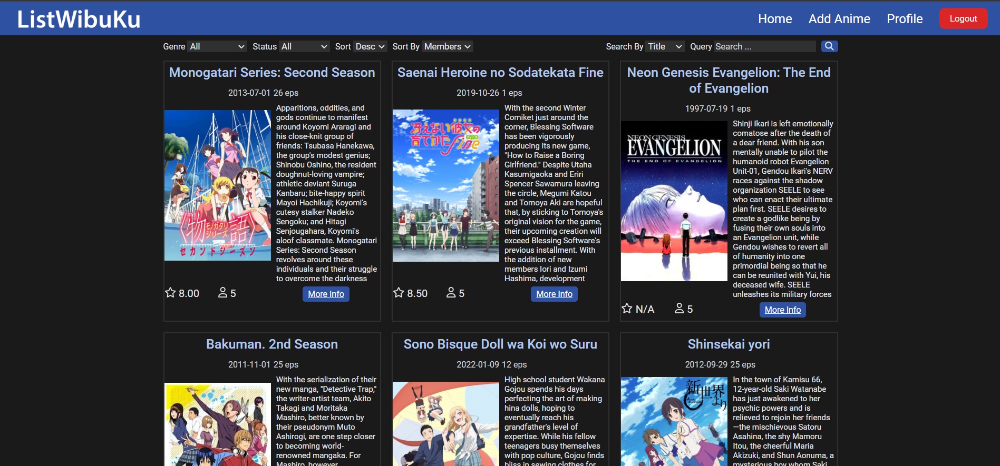
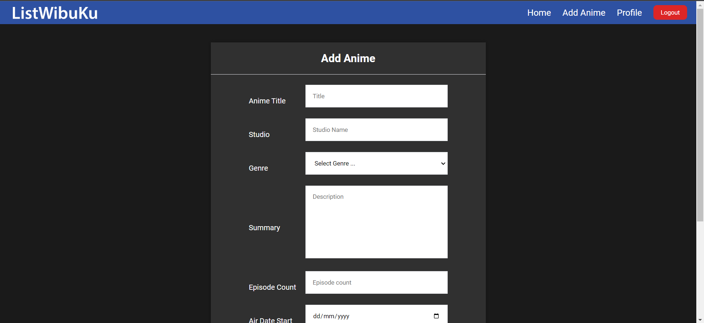
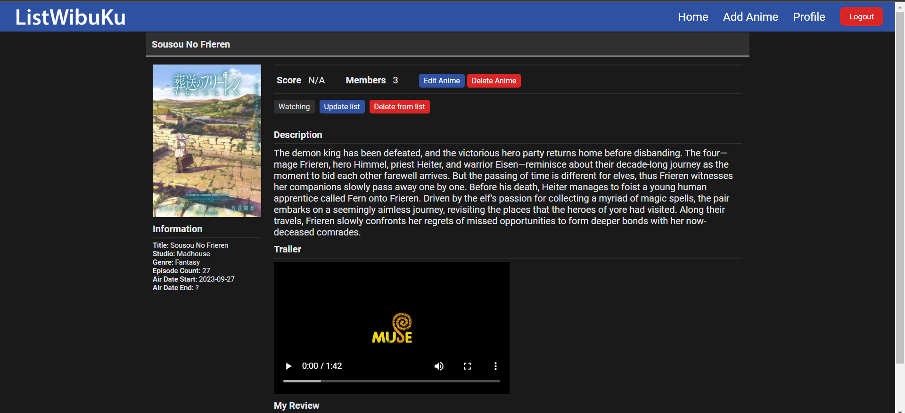
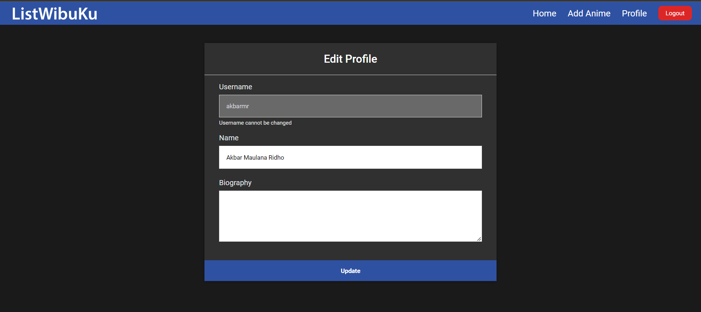
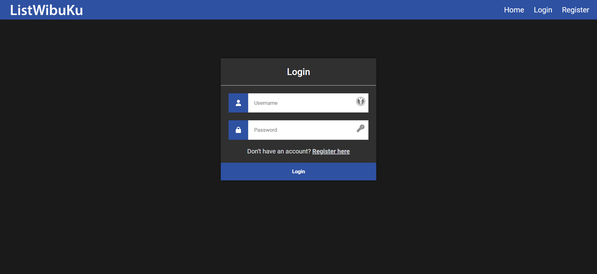
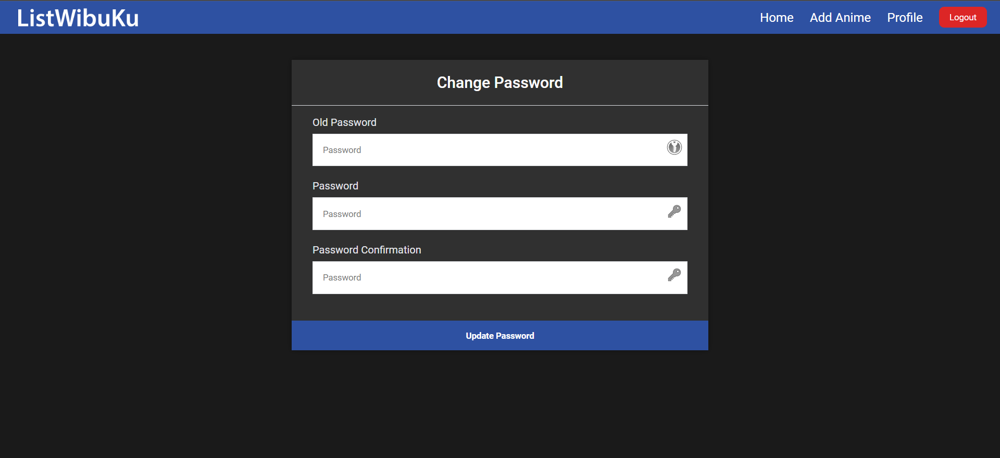
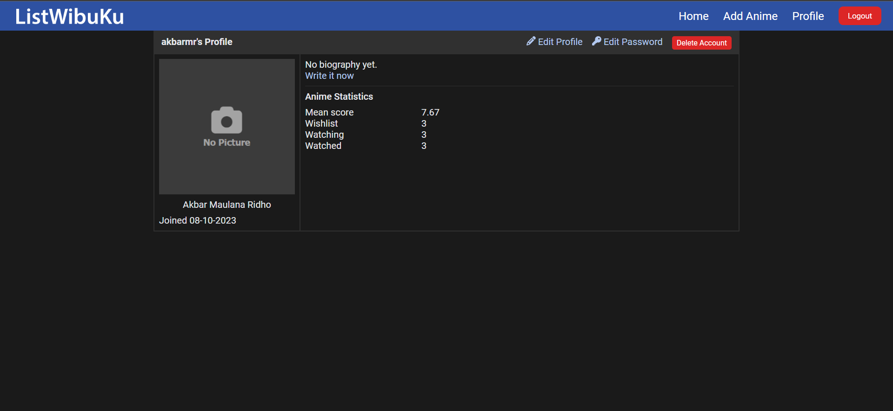
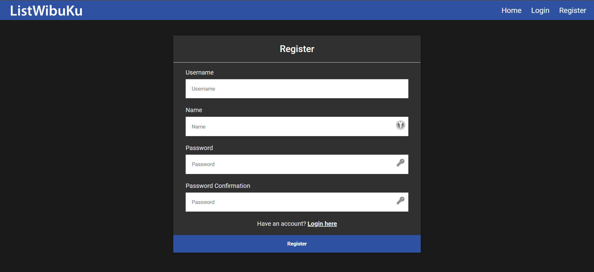
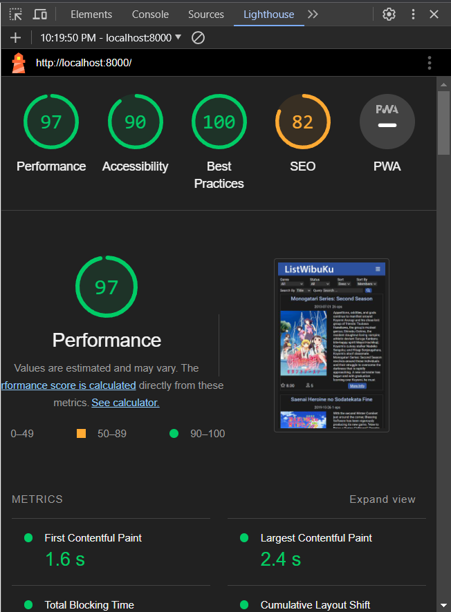
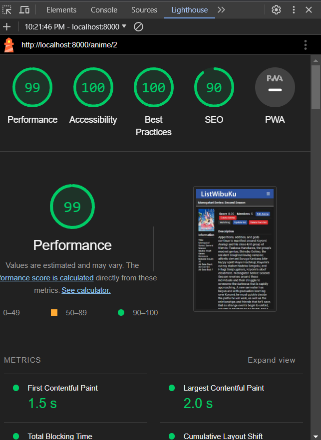

# ListWibuKu

ListWibuKu is a site where you could explore anime and find anime review online

## Daftar Anggota

1. Akbar Maulana Ridho, 13521093
2. Eugene Yap Jin Quan, 13521074

## Requirement

1. Docker Installed

## Installation Guide

1. Clone repo
2. Inside the repository, run `docker compose up`
3. If you are on Linux, make sure storage folder could be modified by another user. This is chaotic, but you could just
   run `chmod -R 777 storage`
4. Run migration `PGPASSWORD=pgpassword psql -h localhost -U postgres -d postgres -f migrations/listwibuku.sql`
5. (Optional) run seeder `PGPASSWORD=pgpassword psql -h localhost -U postgres -d postgres -f migrations/seed.sql`

## How to Run

Make sure the docker container are up and running. Open the website on http://localhost:8000

## Website Display

### Home

### Add anime

### Anime Detail

### Edit Profile

### Login

### Change Password

### Profile

### Register

## Bonus

- All responsive view
- Docker compose configuration
- Lighthouse
  
  

## Pembagian Tugas

Setiap task di bawah meliputi pengerjaan dari server side dan client side

| Tugas                          | NIM                |
|--------------------------------|--------------------|
| Login, Logout                  | 13521093           |
| Register                       | 13521093           |
| Profile                        | 13521074, 13521093 |
| Add and update anime           | 13521074           |
| Update and delete anime status | 13521093           |
| Anime detail                   | 13521074           |
| Anime list page                | 13521093           |
| Add and edit review            | 13521074           |